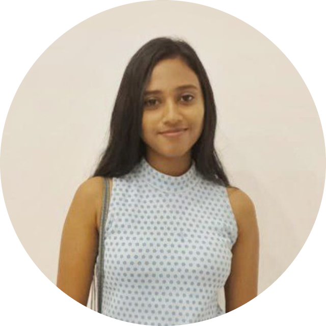

<h1>
  

    
    
Online Music Store

</h1>

## Project Description
This is our 2nd-year first-semester project at SLIIT, This project is a Java web-based application for an online music store named "Musicmash" created with HTML, CSS, JS, Bootstrap, Java, and MySQL.  

## About the Project
Musicmash is a Java web-based application for an online music store that brings a harmonious blend of user-friendly design with JSP (JavaServer Pages) and Servlet technologies. Developed using HTML, CSS, JS, Bootstrap, Java, and MySQL, this website offers a seamless and immersive experience for music enthusiasts. The responsive and visually appealing interface ensures easy navigation, while the integration of Bootstrap and CSS enhances the site's overall responsiveness. Java powers the dynamic functionalities, providing users with a smooth and interactive browsing experience. Behind the scenes, MySQL efficiently manages the database, ensuring secure and reliable storage of product information, user details, and transactions.

## Tech Stack

<ul>
  <li>Front End: HTML5, CSS3, JavaScript, Bootstrap 5</li>
  <li>Back End: Java</li>
  <li>Database: MySQL</li>
  <li>Where It Lives: Hosted it on Apache Tomcat 9.0</li>
</ul>

  
## Contributors
Contributors to make Musicmash successful.  

&nbsp;&nbsp;&nbsp;&nbsp;&nbsp;&nbsp;&nbsp;&nbsp;&nbsp;&nbsp;&nbsp;&nbsp;&nbsp;&nbsp;&nbsp;&nbsp;&nbsp;

&nbsp;&nbsp;&nbsp;&nbsp;&nbsp;&nbsp;&nbsp;&nbsp;&nbsp;&nbsp;&nbsp;&nbsp;&nbsp;&nbsp;&nbsp;&nbsp;&nbsp;

&nbsp;&nbsp;&nbsp;&nbsp;&nbsp;&nbsp;&nbsp;&nbsp;&nbsp;&nbsp;&nbsp;&nbsp;&nbsp;&nbsp;&nbsp;&nbsp;&nbsp;

<a href="https://www.linkedin.com/in/dishal/">Dishal Kanishka</a>&nbsp;&nbsp;&nbsp;&nbsp;&nbsp;&nbsp;&nbsp;
<a href="https://www.linkedin.com/in/kavindudilshan84/">Kavindu Dilshan</a>&nbsp;&nbsp;&nbsp;&nbsp;&nbsp;&nbsp;&nbsp;
<a href="https://www.linkedin.com/in/sachith-nimendra-018828258/">Sachith Nimendra</a>&nbsp;&nbsp;&nbsp;&nbsp;&nbsp;&nbsp;&nbsp;
<a href="https://www.linkedin.com/in/sandunika-nishadi-910410260">Sandunika Nishadi</a>

